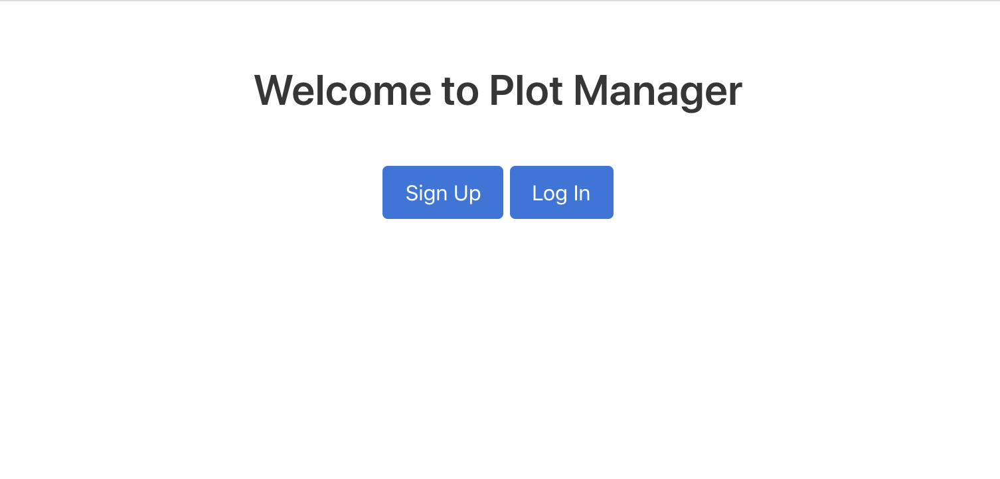

<h1>Plot Manager</h1>

Simple CRUD app to manage plots and characters.

<h2>Installation</h2>

<ol>
  <li>Fork and clone this repository onto your machine.</li>
  <li>Run <code>gem install bundler</code> to install <b>bundler</b>.</li>
  <li>Run <code>git bundle install</code>.</li>
  <li>Execute <code>shotgun</code> in the terminal.</li>
  <li>Navigate to localhost:9393 in your browser.</li>
</ol>

<h2>License</h2>

View the license <a href="https://github.com/tsbrun/plot-manager/blob/main/LICENSE">here</a>.
